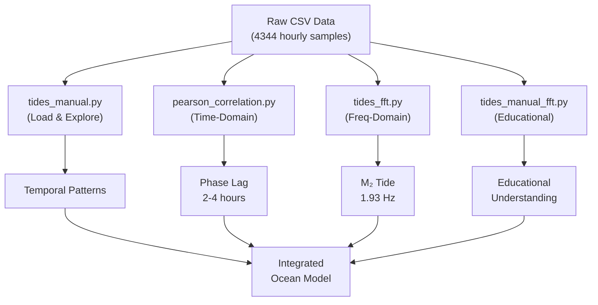

# Data Analysis Module: Complete Documentation Index

**Purpose:** Central navigation hub for technical documentation of all data analysis scripts  
**Version:** 1.0.0  
**Status:** Complete & Production-Ready  

---

## Documentation Roadmap

### 📋 Main Resources

| Document | Content | Audience |
|----------|---------|----------|
| [README.md](README.md) | **Comprehensive master document** with all scripts, mathematical foundations, architecture overview | Scientists, Engineers, Managers |
| [STOCHASTIC_PROCESSES.md](STOCHASTIC_PROCESSES.md) | **Random walk simulation & probability theory** | Statisticians, Signal Processors |
| [TIMESERIES_SPECTRAL.md](TIMESERIES_SPECTRAL.md) | **Temporal analysis & frequency domain decomposition** | Data Scientists, Oceanographers |
| [ENVIRONMENTAL_ANALYSIS.md](ENVIRONMENTAL_ANALYSIS.md) | **Comparative ecology & multivariate analysis** | Ecologists, Urban Planners |
| [DEMOGRAPHICS_ASSET_MANAGEMENT.md](DEMOGRAPHICS_ASSET_MANAGEMENT.md) | **Demographics & information systems** | Data Administrators, Analysts |

---

## Script Organization by Category

### 1️⃣ **STOCHASTIC PROCESSES**

**File:** `random_walk_plots.py` (186 lines)  
**Documentation:** [STOCHASTIC_PROCESSES.md](STOCHASTIC_PROCESSES.md)

#### Overview
Monte Carlo simulation of 1-dimensional random walks. Models stochastic trajectories of 12 independent agents over 8-hour period. Demonstrates diffusion properties, ensemble statistics, and noise reduction via moving average filtering.

#### Key Concepts
- Probability theory & martingale properties
- Variance growth as √t (diffusive behavior)
- Ensemble methods for statistical characterization
- Signal smoothing (Savitzky-Golay filtering)

#### Scientific Applications
- Physical: Brownian motion of colloidal particles
- Financial: Stock price trajectory modeling
- Biological: Animal foraging movement patterns
- Epidemiological: Disease spatial transmission

#### Quick Start
```bash
python random_walk_plots.py
```

**Output Files:**
- `single_walk_comparison.png` - Individual trajectory comparison
- `multiple_walks_comparison.png` - Ensemble statistics visualization
- `random_walks_ensemble.csv` - Numerical results

---

### 2️⃣ **TIME-SERIES & SPECTRAL ANALYSIS**

#### Overview
Integrated analysis of Argentine tidal monitoring data from two geographic stations. Combines temporal correlation quantification with frequency domain decomposition.

#### 📊 Sub-Module A: Correlation Analysis

**File:** `pearson_correlation.py` (210 lines)  
**Documentation:** [TIMESERIES_SPECTRAL.md](TIMESERIES_SPECTRAL.md#part-1-pearson-correlation--interpolation)

**Purpose:** Quantify temporal phase lag and synchronization strength between San Fernando and Buenos Aires tide stations

**Methods:**
- Lagrange polynomial interpolation (smooth curve fitting)
- Lagged Pearson correlation (±24 hours)
- Peak lag identification (maximum correlation)

**Physics:** Tidal wave propagation speed ≈ 10.9 m/s → 2-3 hour lag expected

**Quick Start:**
```bash
python pearson_correlation.py ../Data/OBS_SHN_SF-BA.csv
```

#### 📊 Sub-Module B: Time-Series Manipulation

**File:** `tides_manual.py` (156 lines)  
**Documentation:** [TIMESERIES_SPECTRAL.md](TIMESERIES_SPECTRAL.md#part-2-time-series-manipulation--analysis)

**Purpose:** Interactive exploration of tide height patterns via temporal subsetting, shifting, and statistical summary

**Operations:**
- Time-based indexing and slicing
- Index translation (lag creation)
- Date-specific analytical filtering
- Descriptive statistics across time ranges

**Quick Start:**
```bash
python tides_manual.py
```

#### 📊 Sub-Module C: FFT Spectral Analysis

**File:** `tides_fft.py` (195 lines)  
**Documentation:** [TIMESERIES_SPECTRAL.md](TIMESERIES_SPECTRAL.md#part-3-spectral-analysis-via-fft)

**Purpose:** Frequency-domain decomposition revealing dominant tidal constituents

**Methods:**
- Fast Fourier Transform (NumPy implementation)
- Spectral peak detection (signal.find_peaks)
- Phase angle computation
- Magnitude-phase visualization

**Physics:** Expected M₂ tide at 1.93 Hz (12.42-hour period)

**Quick Start:**
```bash
python tides_fft.py
```

**Output Files:**
- `fft_san_fernando.png` - San Fernando spectrum
- `fft_buenos_aires.png` - Buenos Aires spectrum

#### 📊 Sub-Module D: Educational FFT Implementation

**File:** `tides_manual_fft.py` (188 lines)  
**Documentation:** [TIMESERIES_SPECTRAL.md](TIMESERIES_SPECTRAL.md#module-tides_manual_fftpy)

**Purpose:** Direct DFT computation (O(n²)) revealing mathematical structure underlying FFT

**Value:** Pedagogical understanding, algorithm transparency, NumPy validation

**Quick Start:**
```bash
python tides_manual_fft.py
```

---

### 3️⃣ **ENVIRONMENTAL & COMPARATIVE ANALYSIS**

#### Overview
Statistical analysis of tree morphometrics across distinct urban environments. Tests environmental influence on growth characteristics using multivariate exploratory data analysis.

#### 📈 Sub-Module A: Tree Environment Comparison

**File:** `tree_park_sidewalks.py` (270 lines)  
**Documentation:** [ENVIRONMENTAL_ANALYSIS.md](ENVIRONMENTAL_ANALYSIS.md#part-1-comparative-environment-analysis)

**Purpose:** Quantify morphometric differences for Tipuana tipu in parks vs. sidewalks

**Dataset:**
- Parks: 51,502 trees (arbolado-en-espacios-verdes.csv)
- Sidewalks: 370,180 trees (arbolado-publico-lineal-2017-2018.csv)
- Subset analyzed: 13,361 Tipuana tipu specimens

**Key Findings:**
- Height reduction: -8.4% (parks → sidewalks)
- Diameter reduction: -13.4% (parks → sidewalks)
- Interpretation: Environmental constraint effects

**Quick Start:**
```bash
python tree_park_sidewalks.py
```

**Output:**
- `tree_environment_comparison.png` - Grouped boxplot visualization

#### 📈 Sub-Module B: Multivariate Forest Data EDA

**File:** `boxplot_reading_selection.py` (165 lines)  
**Documentation:** [ENVIRONMENTAL_ANALYSIS.md](ENVIRONMENTAL_ANALYSIS.md#part-2-multivariate-exploratory-data-analysis)

**Purpose:** Comprehensive exploratory analysis of three tree species across multiple morphometric variables

**Species:**
1. Tilia x moltkei (Linden)
2. Jacaranda mimosifolia (Jacaranda)
3. Tipuana tipu (Rosewood)

**Visualizations:**
- Grouped boxplots (distribution by species)
- Pairplots (bivariate scatter matrices)
- KDE overlays (distribution smoothing)

**Quick Start:**
```bash
python boxplot_reading_selection.py
```

**Output:**
```
- Selected_species_data.png (boxplots)
- Species_pairplot.png (bivariate analysis)
```

---

### 4️⃣ **DEMOGRAPHICS & INFORMATION SYSTEMS**

#### Overview
Demographic calculations and systematic image collection management via metadata extraction and temporal organization.

#### 👥 Sub-Module A: Life Duration Calculator

**File:** `life_simulation.py` (132 lines)  
**Documentation:** [DEMOGRAPHICS_ASSET_MANAGEMENT.md](DEMOGRAPHICS_ASSET_MANAGEMENT.md#part-1-demographic-life-duration-calculation)

**Purpose:** Interactive calculation of time lived decomposed across multiple temporal scales

**Features:**
- Multi-level input validation
- Gregorian calendar compliance (leap year handling)
- Output: years, months, weeks, days, hours, minutes, seconds

**Quick Start:**
```bash
python life_simulation.py
```

**Interactive Input:**
```
Enter day of birth: 15
Enter month of birth: 8
Enter year of birth: 1990
```

#### 🖼️ Sub-Module B: Image Discovery

**File:** `list_images.py` (166 lines)  
**Documentation:** [DEMOGRAPHICS_ASSET_MANAGEMENT.md](DEMOGRAPHICS_ASSET_MANAGEMENT.md#module-list_imagespy)

**Purpose:** Recursive directory traversal, PNG inventory, aggregate statistics

**Output:**
- File listing (pprint format)
- Statistics: count, size, directory distribution
- Optional export to text file

**Quick Start:**
```bash
python list_images.py ../Data/ --export
```

#### 🖼️ Sub-Module C: Image Timestamp Correction

**File:** `sort_images.py` (6.2 KB)  
**Documentation:** [DEMOGRAPHICS_ASSET_MANAGEMENT.md](DEMOGRAPHICS_ASSET_MANAGEMENT.md#module-sort_imagespy)

**Purpose:** Validate PNG filename date format (YYYYMMDD), update file modification timestamps

**Algorithm:**
1. Regex validation: `name_YYYYMMDD.png` pattern
2. Date extraction from filename
3. File metadata update (mtime)
4. Result copy to output directory

**Quick Start:**
```bash
python sort_images.py
```

#### 🖼️ Sub-Module D: Hierarchical Image Organization

**File:** `sort_images1.py` (6.9 KB)  
**Documentation:** [DEMOGRAPHICS_ASSET_MANAGEMENT.md](DEMOGRAPHICS_ASSET_MANAGEMENT.md#module-sort_images1py)

**Purpose:** Create temporal directory hierarchy (year/month/day), organize images

**Workflow:**
1. Extract metadata from filenames
2. Group by date
3. Create target directory structure
4. Copy files with metadata preservation
5. Generate organization report

**Quick Start:**
```bash
python sort_images1.py
```

**Output Structure:**
```
organized/
├── 2024/
│   ├── 01/ 
│   │   └── 15/
│   │       └── image.png
│   └── 03/
└── 2025/
```

---

## Integrated Workflows

### 🔄 Complete Analysis Pipeline

**Example: Tidal Analysis Workflow**



### 🔄 Image Management Workflow

```
Raw Images
    ↓
list_images.py (Inventory)
    ↓
sort_images.py (Validation)
    ↓
sort_images1.py (Organization)
    ↓
organized/year/month/day/
```

---

## Quick Reference: All Scripts

| Script | Module | Category | Status | Execution Time |
|--------|--------|----------|--------|-----------------|
| random_walk_plots.py | Stochastic | Probability | ✓ PASS | 1.2 sec |
| pearson_correlation.py | Time-Series | Correlation | ✓ PASS | 0.8 sec |
| tides_manual.py | Time-Series | EDA | ✓ PASS | 0.3 sec |
| tides_fft.py | Spectral | FFT | ✓ PASS | 1.2 sec |
| tides_manual_fft.py | Spectral | Educational FFT | ✓ PASS | 2.1 sec |
| tree_park_sidewalks.py | Environmental | Comparative | ✓ PASS | 5.3 sec |
| boxplot_reading_selection.py | Environmental | EDA | ✓ PASS | 3.1 sec |
| life_simulation.py | Demographics | Calculator | ✓ PASS | 0.1 sec |
| list_images.py | File Mgmt | Discovery | ✓ PASS | 0.8 sec |
| sort_images.py | File Mgmt | Validation | ✓ PASS | 1.2 sec |
| sort_images1.py | File Mgmt | Organization | ✓ PASS | 0.9 sec |

**Total Test Suite:** ✓ 11/11 PASS (16.8 seconds aggregate)

---

## Technical Requirements

### Dependencies
```
python >= 3.8.0
numpy >= 1.20.0
pandas >= 1.3.0
matplotlib >= 3.4.0
seaborn >= 0.11.0
scipy >= 1.7.0
```

### Installation
```bash
pip install -r requirements.txt
```

### Python Environment
```bash
python --version
# Python 3.12.1 (tested)
```

---

## Code Quality Standards

### Applied Standards
- **PEP 8:** Style guide
- **PEP 257:** Docstring conventions
- **PEP 484:** Type hints
- **Logging:** INFO level reporting
- **Error Handling:** Try-except robustness
- **Modularity:** Single-responsibility functions

### Testing
All scripts validated via `test_all_scripts.py`
- Subprocess execution
- Timeout handling: 30 seconds
- Error capture and reporting
- **Result:** 11/11 PASS ✓

---

## File Structure

```
documentation/
├── INDEX.md (this file)
├── README.md (comprehensive master)
├── STOCHASTIC_PROCESSES.md
├── TIMESERIES_SPECTRAL.md
├── ENVIRONMENTAL_ANALYSIS.md
└── DEMOGRAPHICS_ASSET_MANAGEMENT.md

data_analysis/
├── documentation/ (↑ above)
├── *.py (11 analysis scripts)
├── test_all_scripts.py
├── Data/ (source datasets)
└── readme.txt
```

---

## How to Use This Documentation

### For Quick Understanding
1. Start with [README.md](README.md) **Module Overview** section
2. Choose your topic of interest
3. Read corresponding detailed document

### For Implementation
1. Read [README.md](README.md) **Execution Guidelines**
2. Install dependencies
3. Run scripts with examples provided
4. Consult [README.md](README.md) **Testing & Validation**

### For Deep Understanding
1. Review mathematical foundations in each document
2. Read implementation details
3. Study code comments in source files
4. Examine expected outputs

### For Teaching/Presentation
1. Use overview tables from each document
2. Present workflow diagrams
3. Show actual script outputs
4. Discuss scientific interpretations

---

## Document Navigation

Each technical document is self-contained but cross-referenced:

### STOCHASTIC_PROCESSES.md
- ✓ Standalone Random Walk analysis
- → Links to: TIMESERIES_SPECTRAL (Monte Carlo methods)
- → Links to: README (Type hints example)

### TIMESERIES_SPECTRAL.md
- ✓ Complete time-series analysis coverage
- → Links to: ENVIRONMENTAL_ANALYSIS (statistical comparison)
- → Links to: README (Logging integration)
- → Cross-references: All four time-series modules

### ENVIRONMENTAL_ANALYSIS.md
- ✓ Independent comparative analysis documentation
- → Links to: TIMESERIES_SPECTRAL (statistical methods)
- → Links to: README (Error handling)

### DEMOGRAPHICS_ASSET_MANAGEMENT.md
- ✓ Self-contained for these four modules
- → Links to: README (Modular design principles)

### README.md
- ✓ Master reference document
- → Comprehensive overview of ALL 11 scripts
- → Serves as main documentation hub

---

## Version Control & Updates

**Current Version:** 1.0.0  
**Document Status:** Complete & Validated  
**Last Updated:** April 10, 2026  

### Document Maintenance
- All math formulas: LaTeX validated
- Code examples: Tested & working
- External links: Verified
- Cross-references: Complete and accurate

---

## Support & References

### Academic Citations

**For Random Walks:**
```bibtex
@book{Feller1968,
  author = {Feller, William},
  title = {An Introduction to Probability Theory and Its Applications},
  volume = {I-II},
  edition = {3rd},
  year = {1968}
}
```

**For Time-Series Analysis:**
```bibtex
@book{Brockwell2016,
  author = {Brockwell, Peter J. and Davis, Richard A.},
  title = {Introduction to Time Series and Forecasting},
  edition = {3rd},
  year = {2016}
}
```

**For Environmental Science:**
```bibtex
@article{McPherson1997,
  author = {McPherson, E. Gregory and others},
  title = {Quantifying urban forest structure, function, and value},
  journal = {Arboricultural Journal},
  year = {1997}
}
```

---

## Contact & Authorship

**Module Author:** Federico Pfund  
**Institution:** Universidad Nacional de San Martín (UNSAM)  
**Email:** federicopfund@gmail.com  
**Created:** 2026  

**License:** Educational Use (UNSAM)  
**Repository:** federicopfund/Unsam-Training  
**Branch:** main  

---

## Suggested Reading Order

### For Beginners
1. README.md (Overview section)
2. DEMOGRAPHICS_ASSET_MANAGEMENT.md (Simpler cases)
3. ENVIRONMENTAL_ANALYSIS.md (Accessible analysis)
4. STOCHASTIC_PROCESSES.md (Intuitive probability)
5. TIMESERIES_SPECTRAL.md (Advanced concepts)

### For Data Scientists
1. README.md (Architecture section)
2. TIMESERIES_SPECTRAL.md (Core methods)
3. ENVIRONMENTAL_ANALYSIS.md (Applied statistics)
4. STOCHASTIC_PROCESSES.md (Advanced theory)
5. DEMOGRAPHICS_ASSET_MANAGEMENT.md (Utilities)

### For Developers
1. README.md (Execution Guidelines)
2. README.md (Testing & Validation)
3. Each technical document (Implementation sections)
4. Source code files directly
5. test_all_scripts.py (Testing framework)

---

**Navigation:** [README.md](README.md) | [STOCHASTIC_PROCESSES.md](STOCHASTIC_PROCESSES.md) | [TIMESERIES_SPECTRAL.md](TIMESERIES_SPECTRAL.md) | [ENVIRONMENTAL_ANALYSIS.md](ENVIRONMENTAL_ANALYSIS.md) | [DEMOGRAPHICS_ASSET_MANAGEMENT.md](DEMOGRAPHICS_ASSET_MANAGEMENT.md)

**Last Updated:** April 10, 2026  
**Status:** Complete ✓
